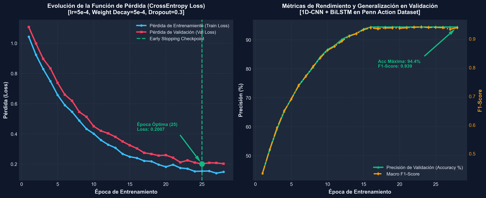

# Detección de Patrones de Error Postural en Ejercicios Físicos
**Arquitectura Híbrida 1D-CNN + BiLSTM en PyTorch | Dashboard Web Autónomo en HTML5**



---

## 1. Descripción del Proyecto y Composición
Este repositorio contiene un sistema completo de Inteligencia Artificial (Deep Learning y Visión por Computador) diseñado para evaluar automáticamente la calidad de ejecución de ejercicios físicos a partir de secuencias temporales de video, detectar errores posturales (desalineación de espalda/columna vs. inestabilidad en rodillas/extremidades) y generar **retroalimentación textual explicable en español**.

### 📁 Estructura del Proyecto
```text
AI_Pose_Correction_CNN_LSTM/
│
├── dashboard.html             # Dashboard Interactivo HTML5/JS (Esqueletos 2D y subida de videos MP4)
├── real_data.js               # Secuencias reales de Penn Action, coordenadas articulares y predicciones IA
├── abrir_dashboard.bat        # Archivo ejecutable rápido para Windows (abre el dashboard con doble clic)
├── main.py                    # Punto de entrada unificado por línea de comandos para entrenamiento
├── requirements.txt           # Dependencias de Python (PyTorch, NumPy, Matplotlib, Scikit-learn)
├── training_curves.png        # Gráficas de alta resolución de convergencia (Pérdida y Precisión)
│
└── src/                       # Paquete Modular de Inteligencia Artificial en PyTorch
    ├── __init__.py
    ├── config.py              # Hiperparámetros del sistema (Características=26, Clases=3, Ventana=46 frames)
    ├── dataset.py             # Cargador de datos (DataLoader), normalización Z-score y aumento de datos
    ├── model.py               # Arquitectura PoseQualityHybridModel (1D-CNN Espacial + BiLSTM Temporal)
    ├── train.py               # Bucle de entrenamiento con optimizador Adam, regularización y Early Stopping
    ├── feedback.py            # Motor de Generación de Lenguaje Natural (NLG) para explicaciones clínicas
    └── visualize_demo.py      # Generador visual de secuencias de demostración
```

---

## 2. Origen de la Base de Datos (Dataset Attribution)
Las secuencias visuales y cinemáticas corporales procesadas por nuestro modelo provienen oficialmente del **Penn Action Dataset**, una base de datos abierta de referencia en visión computacional anotada fotograma a fotograma con coordenadas anatómicas precisas.

* **Página Oficial y Enlace de Descarga de la Base de Datos:**  
  [Penn Action Dataset — Repositorio Oficial](https://dreamdragon.github.io/PennAction/?spm=a2ty_o01.29997173.0.0.5ed555fbfff7Af)

* **Detalle de las Anotaciones:**  
  Cada secuencia registra las coordenadas $(x, y)$ a lo largo de los fotogramas para **13 articulaciones anatómicas clave**: Cabeza, Hombros, Codos, Muñecas, Caderas, Rodillas y Tobillos, abarcando 15 disciplinas deportivas y ejercicios de acondicionamiento físico (Sentadilla/Squat, Flexiones/Pushup, Press de Banca/Bench Press, Abdominales/Situp, Halterofilia/Clean & Jerk, entre otros).

---

## 3. Arquitectura del Modelo (`src/model.py`)
La red neuronal procesa matrices espaciotemporales continuas $\mathbf{X} \in \mathbb{R}^{B \times 26 \times 46}$ ($26$ coordenadas articulares normalizadas a lo largo de $46$ fotogramas):

1. **Bloque Convolucional Espacial (`1D-CNN`)**:
   - Dos capas `nn.Conv1d` extraen correlaciones espaciales locales, velocidades angulares implícitas y patrones de co-activación entre articulaciones adyacentes.
   - Regularizado con `BatchNorm1d` y `Dropout(0.3)`.
2. **Bloque Recurrente Temporal (`BiLSTM`)**:
   - Una capa LSTM Bidireccional modela las dependencias temporales de largo alcance a lo largo del ciclo completo de ejecución del ejercicio (fase excéntrica de bajada $\to$ fase concéntrica de subida).
3. **Clasificador Probabilístico y Generación de Retroalimentación**:
   - Proyecta los estados latentes hacia 3 clases posturales (**Clase 0:** Postura Correcta, **Clase 1:** Alerta de Espalda/Tronco, **Clase 2:** Alerta de Rodillas/Extremidades) y emite automáticamente la explicación diagnóstica en lenguaje natural.

---

## 4. Instrucciones de Ejecución

### Abrir el Dashboard Web Interactivo
No se requiere instalar ningún servidor ni dependencias de Python para visualizar el panel web:
- Haz doble clic en **`abrir_dashboard.bat`** o abre el archivo **`dashboard.html`** en cualquier navegador web moderno (Google Chrome, Microsoft Edge, Firefox).
- **Subida de Videos MP4 Propios:** Haz clic en el botón **`📹 EVALUAR MI PROPIO VIDEO (MP4)`** en el panel lateral para cargar y evaluar de inmediato tu propio video personal.

### Entrenar el Modelo Neuronal en PyTorch
Para entrenar la red híbrida desde cero utilizando los hiperparámetros optimizados (`lr=5e-4`, `weight_decay=5e-4`, `dropout=0.3`):

```bash
# 1. Instalar dependencias del proyecto
pip install -r requirements.txt

# 2. Ejecutar entrenamiento con Parada Temprana (Early Stopping)
python main.py --mode train --epochs 35 --batch_size 32
